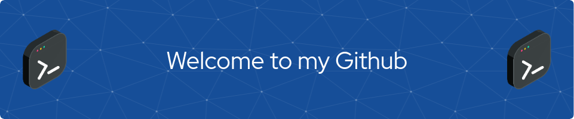

<!-- Saudação -->

<!-- Links centralizados com Ícones -->

  
  

 

<!-- Apresentação -->

Hello 👋, I'm Maicon Botelho!
  
I'm currently pursuing a Bachelor's degree in Software Engineering at UNINTER in Brazil. 

#### Current stack
- 🎖️ Main language: `Javascript`
- 📊 Backend: `Node.js` , `Express` , `Nest.js`, `Prisma`
- 💻 Frontend: `Next.js` , `React.js` , `TypeScript` , `Tailwind CSS` , `HTML5` , `CSS3`
- 📚 Database: `PostgreeSQL` , `MondoDB` , `Firebase`
- ✨ Layout Design: `Figma` , `Canva`
- 🕹️ Tools: `VsCode`

<!-- Dropdown -->

  

    <h2>👨‍💻 More About Me</h2>
  

  

    💬 My interest in programming began in 2023 when I attempted to develop a scheduling application in Java. Although I didn't complete the project, the challenges and obstacles I encountered were what made me fall in love with the field. \o/
  

<!-- Habilidades: Linguagens de Programação -->

 ## 💻 Tech Stack:
  

    
  
 
  
  
 
  
  
  
 

  

 
  

 ## :books: Technologies Studied
 

   
 
  
 
 
 
 
  
 
  
 
  
  
  
  
 
 
 

  
 
<!-- Estatísticas e Habilidades -->
## :bar_chart: GitHub Stats:

  
  
  

 
